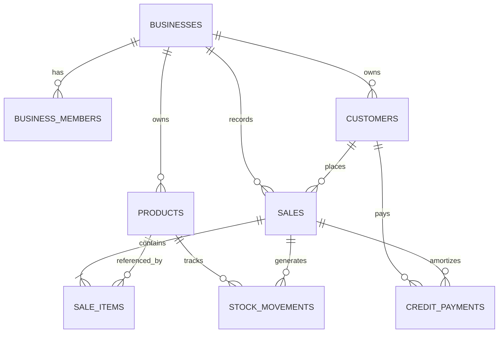
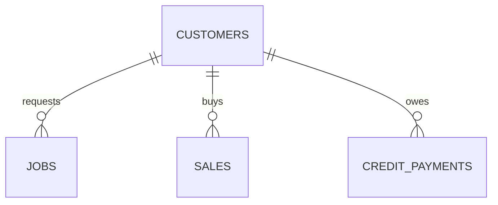

# Plan de Integración de Trabajos, Servicios y Códigos QR Físicos en SpaceSale

**Documento Técnico de Arquitectura y Diseño de Datos**  
**Proyecto:** SpaceSale (`com.example.posapp` / Android & Supabase Central)  
**Fecha:** 2026-08-17  
**Rama:** `feature/scanner-qr-experimental`  

---

## 1. Arquitectura Actual Encontrada

SpaceSale está construido bajo un patrón **Offline-First**, desacoplado y reactivo:
- **Capa UI:** Jetpack Compose nativo con tema Material personalizado (soporte modo claro/oscuro y modo responsive).
- **Capa de Presentación / Estado:** MVVM con Kotlin Coroutines, `StateFlow` y `Channel` para eventos de UI.
- **Capa Local (Fuente Inmediata de Verdad):** SQLite gestionado mediante **Android Room Database** (v2.8.4 con KSP). La aplicación responde instantáneamente a las operaciones del usuario sin bloquearse por la red.
- **Capa Remota (Sincronización y Respaldo):** **Supabase** (PostgreSQL 15+, PostgREST, Auth OTP/Google, Storage privado para imágenes).
- **Motor de Sincronización en Segundo Plano:** `AndroidX WorkManager` (`CloudSyncWorker`), coordinado con una cola transaccional local (`sync_queue`) y cursores monotónicos del servidor (`sync_metadata` y `server_created_at`).
- **Control de Concurrencia e Idempotencia:** Las operaciones financieras críticas (creación de ventas, anulación y ajustes de stock) se ejecutan en el servidor mediante funciones **RPC PL/pgSQL idempotentes** basadas en UUIDs generados por el cliente.
- **Multitenancy y Roles:** Todas las entidades pertenecen estrictamente a un `business_id`. Las autorizaciones se evalúan mediante Row Level Security (RLS) y funciones en el esquema `private` (`can_write_business`, `is_business_member`, `can_manage_business`) para los roles `owner`, `admin`, `staff` y `viewer`.

---

## 2. Tablas Actuales

### 2.1 Tablas en Supabase (PostgreSQL)

| Tabla | Propósito Principal | Claves e Índices Clave |
| :--- | :--- | :--- |
| `public.profiles` | Perfiles de usuario vinculados a `auth.users`. | `id` (PK, FK `auth.users`) |
| `public.businesses` | Negocios/tiendas registradas en el sistema. | `id` (PK), `owner_id` (FK `auth.users`) |
| `public.business_members` | Relación N:M usuario-negocio con roles (`owner`, `admin`, `staff`, `viewer`). | `(business_id, user_id)` (PK) |
| `public.business_invitations` | Invitaciones de nuevos miembros con tokens hash SHA-256. | `id` (PK), `token_hash` (Unique) |
| `public.products` | Catálogo de mercadería con control de stock y precio en centavos. | `id` (PK), `(business_id, barcode)` (Unique parcial) |
| `public.customers` | Directorio unificado de clientes. | `id` (PK), `(business_id, id)` (Unique) |
| `public.sales` | Cabeceras de ventas realizadas (contado, fiado, cerradas o anuladas). | `id` (PK), `(business_id, sold_at)` |
| `public.sale_items` | Líneas de detalle de cada venta con snapshots de producto y precio. | `id` (PK), `sale_id` (FK `sales`), `product_id` (FK nullable `products`) |
| `public.credit_payments` | Abonos o amortizaciones a ventas fiadas. | `id` (PK), `sale_id`, `customer_id` |
| `public.stock_movements` | Auditoría inmutable de entradas y salidas de inventario. | `id` (PK), `product_id`, `sale_id` |

### 2.2 Entidades en Room Database (Android Local)

- `Producto` (tabla `producto`): Almacena catálogo local, stock actual, precios en centavos, código de barras, fotos locales/storage y estado `sync_status`.
- `Cliente` (tabla `cliente`): Datos del cliente, teléfono, notas y `deuda_total_centavos`.
- `Venta` (tabla `venta`): ID local, `sync_id` (UUID remoto), `total_centavos`, `tipo_pago`, `clienteId`, `estado` (`PENDIENTE`, `CERRADO`, `ANULADO`).
- `DetalleVenta` (tabla `detalle_venta`): Snapshot de producto, cantidad, precios de venta y costo en centavos.
- `PagoFiado` (tabla `pago_fiado`): Registro local de amortizaciones.
- `StockMovement` (tabla `stock_movement`): Movimientos de stock en cola.
- `SyncQueueItem` (tabla `sync_queue`): Cola de mutaciones pendientes para sincronizar con Supabase.
- `SyncMetadata` (tabla `sync_metadata`): Punteros y timestamps de sincronización por entidad.
- `BusinessSettings` (tabla `business_settings`): Configuración local del negocio.

---

## 3. Relaciones Actuales



---

## 4. Cómo Funciona Actualmente una Venta

1. **Selección:** En `SalesScreen`, el cajero agrega productos al carrito (`SaleLine(producto, cantidad)`).
2. **Validación:** Se verifica que el carrito no esté vacío, que el negocio coincida y que haya stock disponible en la base de datos local.
3. **Transacción Local (`SalesRepository.checkout`):**
   - Se crea la cabecera `Venta` con `total_centavos`, `tipo_pago` (`EFECTIVO`, `YAPE`, `FIADO`), `sync_id = UUID.randomUUID()` y `estado = "CERRADO"` (o `"PENDIENTE"` si es fiado).
   - Se reduce el stock local de cada producto mediante `decreaseStockIfEnough`.
   - Se insertan los registros `DetalleVenta` con snapshot del nombre, precio unitario y costo.
   - Se insertan los registros `StockMovement` de tipo `SALE` con `quantity_delta = -cantidad`.
   - Si es fiado, se recalcula la deuda en la tabla `cliente`.
4. **Sincronización Remota:**
   - La venta se empaqueta y se envía mediante la función RPC `public.confirm_sale_bundle(payload)`.
   - La función en Supabase abre una transacción con bloqueo `FOR UPDATE` sobre los productos, verifica el stock en el servidor, descuenta el stock en `public.products`, inserta `sales`, `sale_items` y `stock_movements` atómicamente, y devuelve los nuevos niveles de stock para reconciliación.

---

## 5. Cómo Funciona el Scanner

- **Implementación:** `SpaceSaleBarcodeScanner` en `BarcodeScanner.kt` utilizando **Google Play Services Code Scanner** (`play-services-code-scanner:16.1.0`).
- **Formatos soportados:** `EAN_8`, `EAN_13`, `UPC_A`, `UPC_E`, `CODE_128`.
- **Flujo Operativo:**
  1. El usuario presiona el botón de escáner en el punto de venta.
  2. La cámara lee el código de barras y publica el valor en `BarcodeScanBus`.
  3. Si el código corresponde a un producto existente en el catálogo, se incrementa su cantidad en el carrito.
  4. Si no existe, se abre `AddProductScreen` con el código prellenado para su registro inmediato.

---

## 6. Cómo se Maneja el Stock

- **Moneda e Integridad Numérica:** Precios en centavos (`Long`/`bigint`) para evitar imprecisiones de coma flotante.
- **Proyecciones vs. Ledger:** La columna `products.stock` es una **proyección de conveniencia** administrada exclusivamente en el servidor por RPCs (`confirm_sale_bundle`, `apply_stock_movement`, `cancel_sale_bundle`).
- **Auditoría Inmutable:** Cada entrada, salida o ajuste crea un registro inmutable en `stock_movements` con tipos:
  `INITIAL`, `PURCHASE`, `SALE`, `SALE_CANCEL`, `ADJUSTMENT`, `RETURN`, `LOSS`, `DAMAGE`, `EXPIRED`.
- **Escritura Restringida:** Los clientes autenticados no tienen permisos `INSERT` ni `UPDATE` directos sobre `products.stock` ni `stock_movements`; todo pasa por funciones de base de datos protegidas.

---

## 7. Cómo Funcionan los Clientes

- Almacenados en `public.customers` (Supabase) y `cliente` (Room).
- Campos: `id (UUID)`, `business_id`, `name`, `phone`, `notes`, timestamps y soft-delete (`deleted_at`).
- La deuda de fiados (`deuda_total_centavos`) se calcula sumando el saldo deudor de todas las ventas con estado `PENDIENTE` menos los abonos registrados en `credit_payments` (`pago_fiado`).
- Es una entidad **transversal** a todo el negocio.

---

## 8. Cómo Funciona Auth y RLS

- **Identidad:** Supabase Auth (`auth.users`) gestiona credenciales vía email OTP o Google Identity Services.
- **Esquema de Seguridad Privado:**
  - `private.is_business_member(business_id)`: Verifica si el usuario pertenece al negocio.
  - `private.can_write_business(business_id)`: Verifica roles con permiso de escritura (`owner`, `admin`, `staff`).
  - `private.can_manage_business(business_id)`: Verifica roles administrativos (`owner`, `admin`).
- **Políticas RLS:** Cada tabla filtra estrictamente por `business_id`.
- **Principio de Privilegio Mínimo:** Ni la app Android ni la web usan la clave `service_role`. Ambas usan la clave pública `anon` y tokens JWT de sesión.

---

## 9. Tablas Nuevas Realmente Necesarias

Para incorporar el módulo de **Trabajos, Servicios y QR Físicos** sin duplicar código ni crear sistemas paralelos, se añadirán 4 tablas complementarias:

1. **`public.jobs` (Trabajos / Órdenes de Servicio):** Representa la orden de trabajo (impresión, fotocopiado, anillado, etc.).
2. **`public.job_items` (Desglose de Servicios del Trabajo):** Bloques o especificaciones de servicios que componen el trabajo.
3. **`public.qr_tokens` (Códigos QR Físicos Reutilizables):** Registro de etiquetas físicas preimpresas con su estado (`unused`, `assigned`, `disabled`).
4. **`public.qr_batches` (Lotes de Impresión de QR):** Historial de generación de pliegos de etiquetas adhesivas para impresión física.

---

## 10. Modificaciones Necesarias a Tablas Existentes

### 10.1 `public.sales`
- **Agregar columna opcional:** `job_id uuid references public.jobs(id) on delete set null`
- **Propósito:** Permitir trazabilidad directa cuando un trabajo terminado es cobrado en caja y convertido en venta.

### 10.2 `public.sale_items`
- **Columna `product_id`:** Ya es `uuid` nullable en la base de datos actual.
- **Agregar columna opcional:** `job_item_id uuid references public.job_items(id) on delete set null`
- **Agregar columna opcional:** `item_type text not null default 'PRODUCT' check (item_type in ('PRODUCT', 'SERVICE', 'JOB'))`
- **Propósito:** Permitir que una misma venta combine **mercadería con stock** (`item_type = 'PRODUCT'`) y **servicios o trabajos** (`item_type = 'SERVICE' | 'JOB'`).

### 10.3 RPC `public.confirm_sale_bundle`
- **Modificación:** Permitir que las líneas de venta con `product_id IS NULL` o `item_type IN ('SERVICE', 'JOB')` no requieran movimientos de inventario (`stock_movements`), mientras que las líneas con `product_id` continúen aplicando el estricto descuento y verificación de stock actual.

---

## 11. Modelo "jobs" (Órdenes de Trabajo)

```sql
create table public.jobs (
    id uuid primary key default gen_random_uuid(),
    business_id uuid not null references public.businesses(id) on delete cascade,
    customer_id uuid references public.customers(id) on delete set null,
    customer_name_snapshot text not null check (char_length(trim(customer_name_snapshot)) between 1 and 160),
    customer_phone_snapshot text,
    description text,
    status text not null check (status in ('received', 'in_progress', 'ready', 'delivered', 'cancelled')) default 'received',
    total_cents bigint not null default 0 check (total_cents >= 0),
    notes text not null default '',
    sale_id uuid references public.sales(id) on delete set null,
    ready_at timestamptz,
    delivered_at timestamptz,
    created_by uuid references auth.users(id) on delete set null,
    created_at timestamptz not null default now(),
    updated_at timestamptz not null default now(),
    deleted_at timestamptz,
    constraint jobs_business_id_id_unique unique (business_id, id)
);
```

- **Estados del Trabajo:**
  1. `received` (Recibido / En cola)
  2. `in_progress` (En proceso de impresión / encuadernación)
  3. `ready` (Listo para recojo / Notificación por WhatsApp)
  4. `delivered` (Entregado al cliente / QR liberado)
  5. `cancelled` (Cancelado)

---

## 12. Modelo "job_items" (Líneas de Servicio)

```sql
create table public.job_items (
    id uuid primary key default gen_random_uuid(),
    business_id uuid not null references public.businesses(id) on delete cascade,
    job_id uuid not null references public.jobs(id) on delete cascade,
    service_type text not null default 'GENERAL', -- 'FOTOCOPIA', 'IMPRESION', 'ANILLADO', 'PLASTIFICADO', 'DISENO', 'SCAN', etc.
    description text not null check (char_length(trim(description)) between 1 and 200),
    paper_size text,                             -- 'A4', 'A3', 'OFICIO', 'CARTA', etc.
    color_mode text,                             -- 'BN', 'COLOR', 'FULL_COLOR'
    side_mode text,                              -- 'SIMPLE', 'DUPLEX'
    quantity integer not null default 1 check (quantity > 0),
    pages integer default 1 check (pages > 0),
    copies integer default 1 check (copies > 0),
    unit_price_cents bigint not null default 0 check (unit_price_cents >= 0),
    subtotal_cents bigint not null default 0 check (subtotal_cents >= 0),
    notes text not null default '',
    created_at timestamptz not null default now(),
    constraint job_items_business_job_fk
        foreign key (business_id, job_id)
        references public.jobs(business_id, id)
        on delete cascade
);
```

---

## 13. Modelo "qr_tokens" y "qr_batches"

```sql
create table public.qr_batches (
    id uuid primary key default gen_random_uuid(),
    business_id uuid not null references public.businesses(id) on delete cascade,
    quantity integer not null check (quantity > 0),
    created_by uuid references auth.users(id) on delete set null,
    created_at timestamptz not null default now()
);

create table public.qr_tokens (
    id uuid primary key default gen_random_uuid(),
    business_id uuid not null references public.businesses(id) on delete cascade,
    token text not null unique check (char_length(token) between 6 and 16),
    status text not null check (status in ('unused', 'assigned', 'disabled')) default 'unused',
    job_id uuid references public.jobs(id) on delete set null,
    batch_id uuid references public.qr_batches(id) on delete set null,
    assigned_at timestamptz,
    released_at timestamptz,
    created_at timestamptz not null default now(),
    updated_at timestamptz not null default now(),
    constraint qr_tokens_business_id_id_unique unique (business_id, id)
);
```

### Generación de Tokens sin Ambigüedades
- Tokens de 8 caracteres aleatorios extraídos del conjunto de 31 caracteres seguros:
  `23456789ABCDEFGHJKMNPQRSTUVWXYZ` (excluye `0, O, 1, I, L` para evitar confusiones al leer visualmente).

---

## 14. Relación Jobs ↔ Customers



- **Reutilización Total:** Se utiliza exactamente la tabla `public.customers`.
- Al crear un `job`:
  - Se selecciona un cliente existente o se crea en la libreta compartida de clientes.
  - Se guardan `customer_name_snapshot` y `customer_phone_snapshot` en la orden para garantizar inmutabilidad histórica.
  - En la ficha del cliente, se podrá consultar: Historial de Ventas, Deuda de Fiados y **Historial de Trabajos Realizados**.

---

## 15. Relación Jobs ↔ Sales

Un trabajo NO es automáticamente una venta. El ciclo operativo permite tres modalidades:

```text
[Flujo 1: Solo Venta de Mercadería]
Productos en Carrito ──────────► [COBRAR] ──────────► Venta (Descuenta Stock)

[Flujo 2: Registro de Trabajo de Impresión]
Recepción de Trabajo ──────────► [RECIBIDO] ──► [EN PROCESO] ──► [LISTO] ──► [ENTREGADO]
(No genera venta obligatoria si fue pagado por anticipo externo o convenio)

[Flujo 3: Entrega con Cobro en Caja Integrado]
Trabajo Listo ────────► [ENTREGAR Y COBRAR]
                                │
                                ▼
                   Se cargan ítems al POS de SpaceSale
                   + Opcional: Agregar productos (Folder, Lapicero)
                                │
                                ▼
                   Checkout unificado (Efectivo / Yape / Fiado)
                                │
                   ┌────────────┴────────────┐
                   ▼                         ▼
             Genera VENTA              Job = DELIVERED
         (Items Mercadería         (QR Token = UNUSED)
          descuentan stock)
```

---

## 16. Compatibilidad con Web QR

El sistema web (`scanerqrsales.grafiplotvasquez.lat` o módulo web) se conecta directamente al **mismo Supabase**:

1. **Lectura Pública de Seguimiento (`/t/:token`):**
   - Se crea una política RLS controlada en `public.qr_tokens` y una función RPC segura (`get_public_job_by_token(p_token text)`) o vista protegida que expone únicamente los datos esenciales del trabajo (número de orden, estado actual, fecha estimada, ítems de servicio y total) sin filtrar datos sensibles del negocio.
2. **Operaciones del Personal:**
   - Si el operario inicia sesión con su cuenta en la web, el JWT le otorga permisos de escritura vía `can_write_business` para cambiar estados, registrar trabajos y generar lotes de impresión.

---

## 17. Compatibilidad Futura con Realtime

- **Publicaciones:** Se agregan `jobs` y `qr_tokens` a `supabase_realtime`:
  ```sql
  alter publication supabase_realtime add table public.jobs;
  alter publication supabase_realtime add table public.qr_tokens;
  ```
- **Resiliencia:** La consistencia del sistema nunca depende exclusivamente de Realtime. Si la aplicación estuvo cerrada o sin cobertura, el motor de sincronización (`CloudSyncWorker`) realiza un pull incremental de cambios pendientes al restablecerse la red.

---

## 18. Riesgos de Migración y Estrategia de Mitigación

| Riesgo | Impacto | Mitigación |
| :--- | :--- | :--- |
| **Bloqueo o alteración de ventas existentes** | Crítico | Las migraciones son puramente aditivas (`ADD COLUMN IF NOT EXISTS`). Las ventas actuales de productos continúan operando con 100% de compatibilidad. |
| **Incompatibilidad de tipos monetarios** | Medio | En el proyecto web anterior se usaba `numeric(10,2)`. En SpaceSale todo se unifica a `bigint` centavos (`total_cents`, `unit_price_cents`, `subtotal_cents`), garantizando precisión absoluta. |
| **Confusión entre Código de Barras y QR** | Bajo | El escáner detectará el formato del contenido: URLs con `/t/` o tokens alfanuméricos de 8 caracteres derivan al flujo de Trabajos; códigos EAN/UPC derivan al flujo de Catálogo POS. |

---

## 19. SQL y Migraciones Propuestas

La migración se encapsula en un archivo transaccional:  
`supabase/migrations/202608180001_jobs_and_qr_schema.sql`

```sql
begin;

-- 1. Modificaciones a tablas existentes
alter table public.sales
    add column if not exists job_id uuid;

alter table public.sale_items
    add column if not exists job_item_id uuid,
    add column if not exists item_type text not null default 'PRODUCT'
        check (item_type in ('PRODUCT', 'SERVICE', 'JOB'));

-- 2. Lotes de QR
create table if not exists public.qr_batches (
    id uuid primary key default gen_random_uuid(),
    business_id uuid not null references public.businesses(id) on delete cascade,
    quantity integer not null check (quantity > 0),
    created_by uuid references auth.users(id) on delete set null,
    created_at timestamptz not null default now()
);

-- 3. Trabajos
create table if not exists public.jobs (
    id uuid primary key default gen_random_uuid(),
    business_id uuid not null references public.businesses(id) on delete cascade,
    customer_id uuid references public.customers(id) on delete set null,
    customer_name_snapshot text not null check (char_length(trim(customer_name_snapshot)) between 1 and 160),
    customer_phone_snapshot text,
    description text,
    status text not null check (status in ('received', 'in_progress', 'ready', 'delivered', 'cancelled')) default 'received',
    total_cents bigint not null default 0 check (total_cents >= 0),
    notes text not null default '',
    sale_id uuid references public.sales(id) on delete set null,
    ready_at timestamptz,
    delivered_at timestamptz,
    created_by uuid references auth.users(id) on delete set null,
    created_at timestamptz not null default now(),
    updated_at timestamptz not null default now(),
    deleted_at timestamptz,
    constraint jobs_business_id_id_unique unique (business_id, id)
);

-- 4. Ítems del Trabajo
create table if not exists public.job_items (
    id uuid primary key default gen_random_uuid(),
    business_id uuid not null references public.businesses(id) on delete cascade,
    job_id uuid not null references public.jobs(id) on delete cascade,
    service_type text not null default 'GENERAL',
    description text not null check (char_length(trim(description)) between 1 and 200),
    paper_size text,
    color_mode text,
    side_mode text,
    quantity integer not null default 1 check (quantity > 0),
    pages integer default 1 check (pages > 0),
    copies integer default 1 check (copies > 0),
    unit_price_cents bigint not null default 0 check (unit_price_cents >= 0),
    subtotal_cents bigint not null default 0 check (subtotal_cents >= 0),
    notes text not null default '',
    created_at timestamptz not null default now(),
    constraint job_items_business_job_fk
        foreign key (business_id, job_id)
        references public.jobs(business_id, id)
        on delete cascade
);

-- 5. Tokens QR Físicos
create table if not exists public.qr_tokens (
    id uuid primary key default gen_random_uuid(),
    business_id uuid not null references public.businesses(id) on delete cascade,
    token text not null unique check (char_length(token) between 6 and 16),
    status text not null check (status in ('unused', 'assigned', 'disabled')) default 'unused',
    job_id uuid references public.jobs(id) on delete set null,
    batch_id uuid references public.qr_batches(id) on delete set null,
    assigned_at timestamptz,
    released_at timestamptz,
    created_at timestamptz not null default now(),
    updated_at timestamptz not null default now(),
    constraint qr_tokens_business_id_id_unique unique (business_id, id)
);

-- Índices de alto rendimiento
create index if not exists idx_jobs_business_status on public.jobs(business_id, status, created_at desc);
create index if not exists idx_jobs_customer_id on public.jobs(customer_id, created_at desc);
create index if not exists idx_job_items_job_id on public.job_items(job_id);
create index if not exists idx_qr_tokens_business_status on public.qr_tokens(business_id, status);
create index if not exists idx_qr_tokens_token on public.qr_tokens(token);
create index if not exists idx_qr_tokens_job_id on public.qr_tokens(job_id);

-- Triggers de actualización de updated_at
create trigger jobs_set_updated_at
before update on public.jobs
for each row execute function public.set_updated_at();

create trigger qr_tokens_set_updated_at
before update on public.qr_tokens
for each row execute function public.set_updated_at();

-- Habilitación de Row Level Security
alter table public.qr_batches enable row level security;
alter table public.jobs enable row level security;
alter table public.job_items enable row level security;
alter table public.qr_tokens enable row level security;

-- Políticas RLS para Miembros del Negocio
create policy qr_batches_select_member on public.qr_batches for select to authenticated
using (private.is_business_member(business_id));

create policy qr_batches_insert_writer on public.qr_batches for insert to authenticated
with check (private.can_write_business(business_id));

create policy jobs_select_member on public.jobs for select to authenticated
using (private.is_business_member(business_id));

create policy jobs_insert_writer on public.jobs for insert to authenticated
with check (private.can_write_business(business_id));

create policy jobs_update_writer on public.jobs for update to authenticated
using (private.can_write_business(business_id))
with check (private.can_write_business(business_id));

create policy job_items_select_member on public.job_items for select to authenticated
using (private.is_business_member(business_id));

create policy job_items_insert_writer on public.job_items for insert to authenticated
with check (private.can_write_business(business_id));

create policy job_items_update_writer on public.job_items for update to authenticated
using (private.can_write_business(business_id))
with check (private.can_write_business(business_id));

create policy qr_tokens_select_member on public.qr_tokens for select to authenticated
using (private.is_business_member(business_id));

create policy qr_tokens_insert_writer on public.qr_tokens for insert to authenticated
with check (private.can_write_business(business_id));

create policy qr_tokens_update_writer on public.qr_tokens for update to authenticated
using (private.can_write_business(business_id))
with check (private.can_write_business(business_id));

-- Política de lectura pública para seguimiento de QR por clientes
create policy qr_tokens_public_read on public.qr_tokens for select to anon
using (status = 'assigned');

create policy jobs_public_read on public.jobs for select to anon
using (id in (select job_id from public.qr_tokens where status = 'assigned'));

create policy job_items_public_read on public.job_items for select to anon
using (job_id in (select job_id from public.qr_tokens where status = 'assigned'));

-- Permisos
grant select, insert, update on public.qr_batches to authenticated;
grant select, insert, update on public.jobs to authenticated;
grant select, insert, update on public.job_items to authenticated;
grant select, insert, update on public.qr_tokens to authenticated;
grant select on public.qr_tokens to anon;
grant select on public.jobs to anon;
grant select on public.job_items to anon;

commit;
```

---

## 20. Orden Recomendado de Implementación

1. **Paso 1 (Completado):** Elaboración y validación del plan integral de arquitectura (`JOB_INTEGRATION_PLAN.md`).
2. **Paso 2:** Creación del archivo de migración SQL en `supabase/migrations/202608180001_jobs_and_qr_schema.sql` y funciones RPC de generación y liberación de tokens.
3. **Paso 3:** Incorporación de las entidades de datos en Android (`Job`, `JobItem`, `QrToken`, `QrBatch`) en `Entities.kt`, creación de sus respectivos DAOs (`JobDao`, `QrTokenDao`) y actualización de `AppDatabase.kt`.
4. **Paso 4:** Actualización del motor de sincronización (`CloudSyncCoordinator`, `CloudSyncWorker`) para sincronizar trabajos y tokens QR sin impactar el catálogo de inventario existente.
5. **Paso 5:** Adaptación del escáner en Android para bifurcar dinámicamente entre códigos de barra de mercadería (POS) y códigos QR de trabajos.
6. **Paso 6:** Implementación progresiva de la interfaz de usuario para visualización, cambio de estados y cobro/conversión de trabajos a ventas.


---

## 21. Refinamientos de Arquitectura y Seguridad (Revisión del Plan)

A continuación se resumen las correcciones y mejoras aplicadas en la migración supabase/migrations/202608180001_jobs_and_qr_schema.sql:

1. **Eliminación de lectura directa non**:
   - Se revocaron todos los permisos de SELECT directo a non sobre jobs, job_items, qr_tokens y qr_batches.
   - Se eliminaron las políticas RLS públicas abiertas.
   - Se implementó la función RPC security definer public.get_public_job_by_token(p_token text) que expone únicamente los campos públicos de seguimiento sin permitir enumerar registros.

2. **Eliminación de la relación circular jobs.sale_id <-> sales.job_id**:
   - Se eliminó la columna jobs.sale_id. La relación es estrictamente unidireccional desde sales.job_id (nullable FK a jobs.id).

3. **Simplificación de sale_items.item_type**:
   - Restricción CHECK (item_type IN ('PRODUCT', 'SERVICE')). Los ítems de trabajo vendidos se registran como SERVICE vinculados a job_item_id.

4. **Operación de Liberación de QR Explícita e Independiente**:
   - Cambiar un trabajo a estado delivered ya **no** libera automáticamente el token QR.
   - La liberación se realiza mediante la RPC transaccional explícita 
elease_qr(business_id, token).

5. **RPCs Transaccionales con Bloqueo de Concurrencia (FOR UPDATE)**:
   - public.create_job_bundle(business_id, payload): Creación atómica idempotente de trabajo + ítems + vinculación de QR.
   - public.assign_qr_to_job(business_id, token, job_id): Bloqueo explícito FOR UPDATE sobre el token para evitar asignaciones concurrentes.
   - public.release_qr(business_id, token): Bloqueo explícito FOR UPDATE para cambio atómico a estado unused y job_id = null.

6. **Integridad Multitenant Coherente (usiness_id)**:
   - Todas las claves foráneas compuestas (usiness_id, id) garantizan que no puedan asociarse customers, jobs o qr_tokens pertenecientes a distintos negocios.

7. **Proceso de Despliegue Seguro**:
   - La migración está contenida en una transacción determinista (egin; ... commit;) idempotente con reconstrucción limpia de políticas e índices.
   - **Nota de Ejecución:** No se ha ejecutado ninguna consulta contra la instancia remota de Supabase; los cambios permanecen en el repositorio local para revisión.
